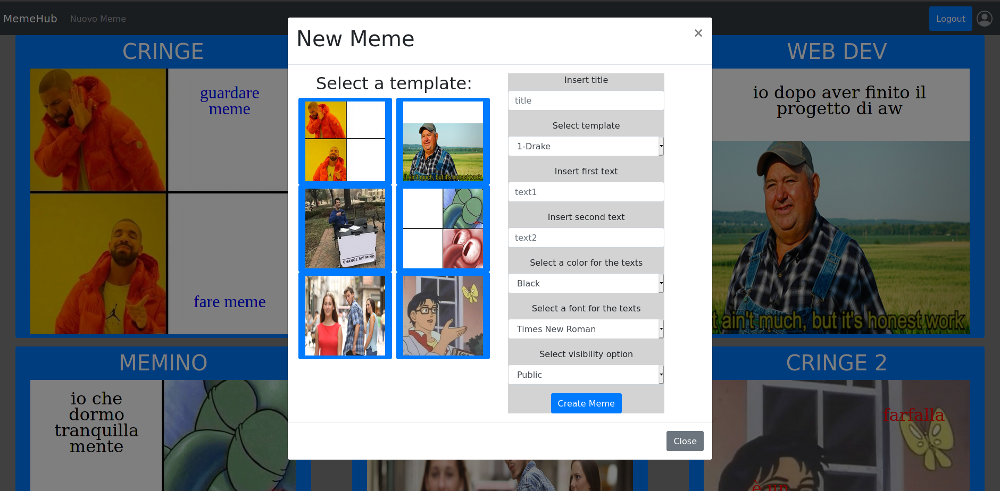

## React Client Application Routes

- Route `/`: indirizza verso la pagina principale del sito su cui avvengono tutte le operazioni visto che ho scelto di visualizzare e creare i meme tramite dei modal.
- Route `/login`: indirizza verso la pagina che contiene il form per permettere il login degli utenti
- ...

## API Server


- GET `/api/images`
  - ottiene la lista di tutte le immagini presenti nel db
  - request parameters: niente
  - request body: niente
  - error response: 404 (not found), 500 (generic error)
  - response body: array di oggetti con i campi che compongono le immagini contenute nel db
  
    ``` JSON
  {
   "id": "i.id", "name": "i.name", "textfields": "i.textfields"
  }
  ```

- GET `/api/memes`
  - ottiene la lista di tutti i meme presenti nel db
  - request parameters: niente
  - request body: niente
  - error response: 404 (not found), 500 (generic error)
  - response body: array di oggetti con i campi che compongono i meme contenuti nel db
- POST `/api/memes`
  - request parameters: niente
  - request body: un json con tutti i campi del meme creato (tranne l'id che viene aggiunto dal db)  che quindi contiene i seguenti campi:


    ``` JSON
  {
    "background" : "meme.background",
    "title" : "meme.title",
    "fields" : "meme.fields",
    "text1" : "meme.text1",
    "text2" : "meme.text2",
    "text3" : "meme.text3",
    "font" : "meme.font",
    "color" : "meme.color",
    "protect" : "meme.protect",
    "user" : "meme.user",
  }
  ```
  - error response: 503 (server error)
  - response: 200 ok (successo)
  - response body: niente
- DELETE `/api/memes/${id}`
  - request parameters: l'id del meme da cancellare
  - request body: niente
  - response: 204 ok  (successo)
  - error response: 503 (server error)
  -ha come request parameter l'id del meme da cancellare
  -non ritorna nulla
- POST `/api/sessions`
  - autentica l'utente che sta cercando di loggarsi
  - request parameters: niente
  - request body: credentials, che contiene username e password
  ``` JSON
  {
    "username": "username",
    "password": "password"
  }
  ```
  - response: 200
  - error response: 500 (server) 401 (!user)
  - response body: restituisce lo user.name che contiene id e username

- DELETE `/api/sessions/current`
  - logout dell'utente corrente
  - request paramenters: niente
  - request body: niente
  - response: 200 (successo)
  - error response: 500 (errore generico), 401 (utente non loggato) 
  - response body: niente
- GET `/api/sessions/current`
  - verifica che l'utente sia loggato
  - request parameters: niente
  - request body: niente
  - response 200 (successo)
  - error response: 500 (errore generico), 401 (utente non autenticato)
  - response body: l'utente autenticato
  ``` JSON
  {
    "id": 1,
    "username": "user1@mail.com", 
    "name": "user1"
  }
  ```

## Database Tables

- Table `users` - contains xx yy zz
- Table `something` - contains ww qq ss
- ...
- Table `images` - contains id name textfields
- Table `memes` - contain id background title fields text1 text2 text3 font color protect user
- Table `users` - contains id email password user

## Main React Components

- `AddMeme` (in `addMeme.js`): il componente si occupa di visualizzare il form da compilare per creare un meme, se i dati inseriti nel form non rispettano i requisiti (titolo definito e almeno un campo di testo) non permette di creare il meme finchè non si aggiornano i campi
-`CopyMeme` (in `addMeme.js`): il componente ha un funzionamento similare ad AddMeme, con la differenza che i campi del form hanno come valore predefinito i valori dei campi del meme e il background non può essere cambiato.
- `LoginForm` (in `loginForm.js`): componente che visualizza il form per loggarsi nell'applicazione, esegue anche la verifica lato client di username e password
- `MemeScreen` (in `memeScreen.js`): componente che contiene al suo interno il componente che si occupa di mostrare tutti i meme presenti e mostrare o nascondere i modal ospitati all'interno di 3 componenti diversi tramite l'uso di 3 variabili di stato
-`DisplayMemes` (in `memeScreen.js`): si occupa di visualizzare l'immagine di background con sopra i campi di testo contenuti all'interno dell'oggetto meme. Il componente riceve in ingresso il meme da rappresentare e tramite uno switch ritorna un componente differente in base a che immagine si ha nel background
-`ShowImageModal` (in `modal.js`): Componente che viene renderizzato dopo aver cliccato su un meme nella home, permette di visualizzare il meme e i suoi dati (se l'utente è loggato si vedono tutti) tramite un modal, sul footer del modal sono presenti i tasti per copiare il meme o nel caso in cui l'autore sia lo stesso dell'utente cancellare il meme. Tra i parametri riceve l'useEffect per cancellare il meme dal db, l'useffect per aggiungere un meme, il meme da visualizzare, la variabile di stato che tiene traccia se l'utente è loggato e l'eventuale nome utente.

(only _main_ components, minor ones may be skipped)

## Screenshot



## Users Credentials

- user1@mail.com, password1 
- user2@mail.com, password2 
- user3@mail.com, password3
